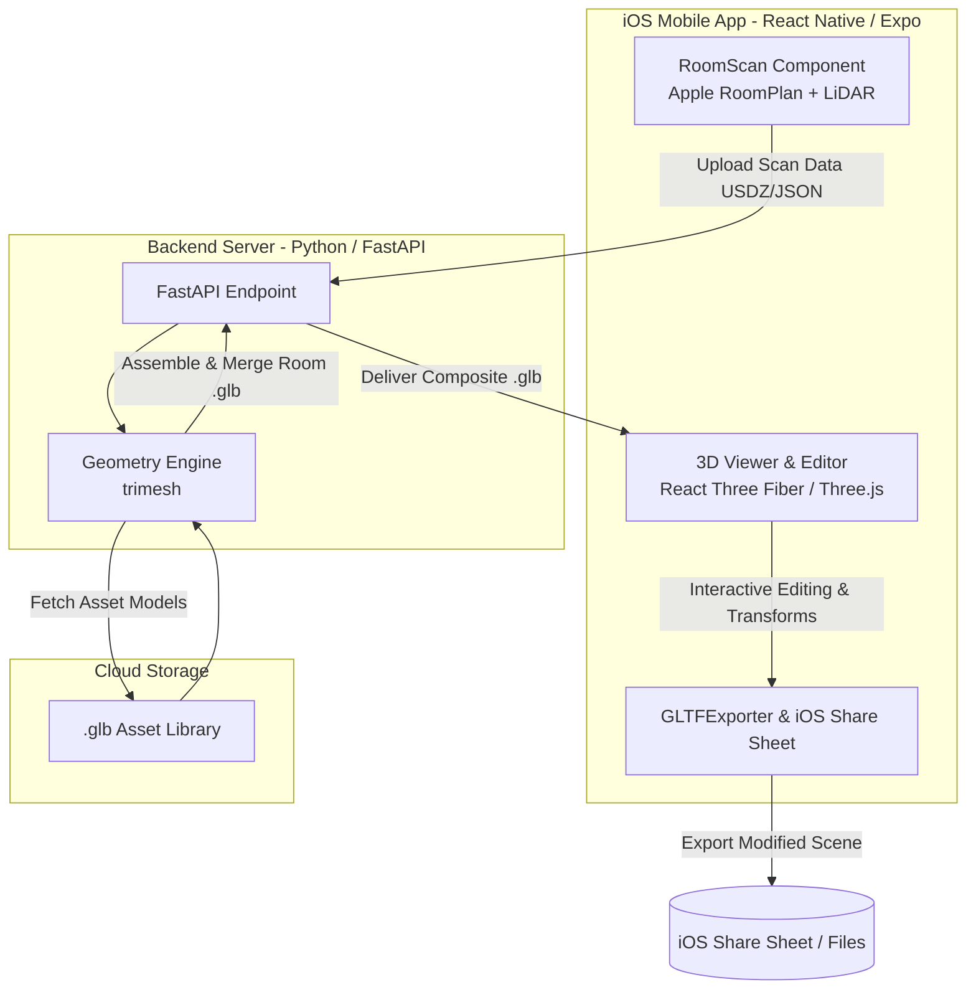

# System Flow

```mermaid
flowchart TD
    subgraph MobileApp [iOS Mobile App - React Native / Expo]
        direction TB
        Scanner[RoomScan Component <br/> Apple RoomPlan + LiDAR]
        Viewer[3D Viewer & Editor <br/> React Three Fiber / Three.js]
        Exporter[GLTFExporter & iOS Share Sheet]
    end

    subgraph Server [Backend Server - Python / FastAPI]
        direction TB
        API[FastAPI Endpoint]
        Processor[Geometry Engine <br/> trimesh]
    end

    subgraph Storage [Cloud Storage]
        Assets[.glb Asset Library]
    end

    %% Data Flow
    Scanner -->|Upload Scan Data USDZ/JSON| API
    API --> Processor
    Processor -->|Fetch Asset Models| Assets
    Assets --> Processor
    Processor -->|Assemble & Merge Room .glb| API
    API -->|Deliver Composite .glb| Viewer
    Viewer -->|Interactive Editing & Transforms| Exporter
    Exporter -->|Export Modified Scene| Device[(iOS Share Sheet / Files)]
```